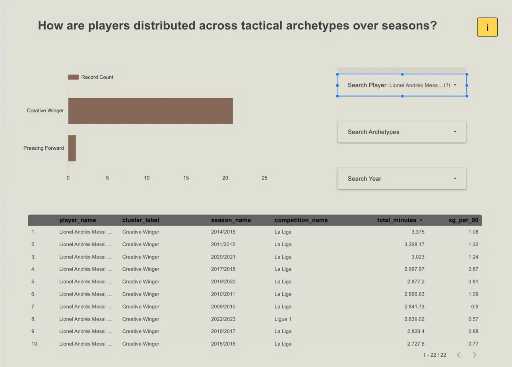
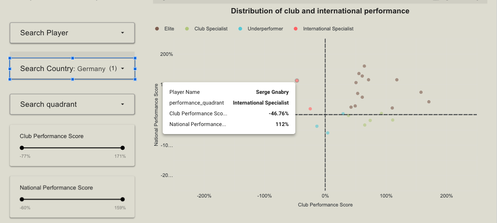
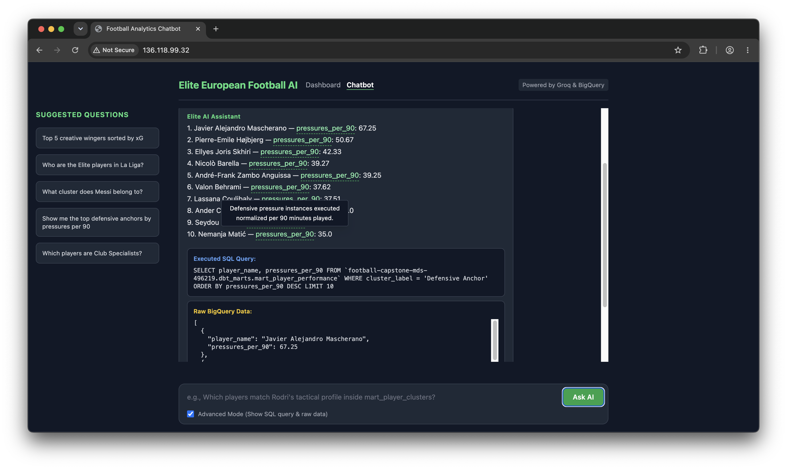
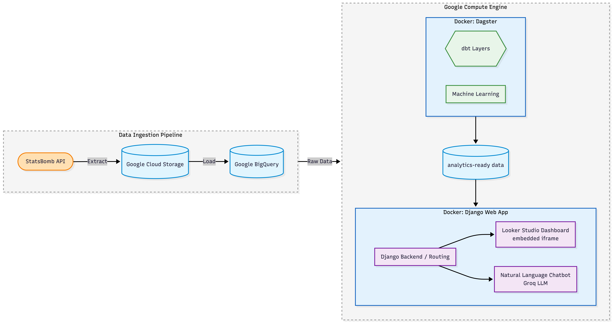
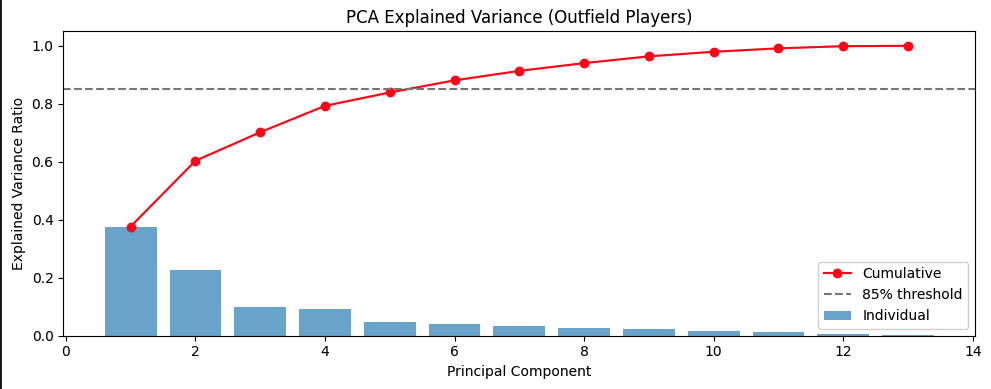
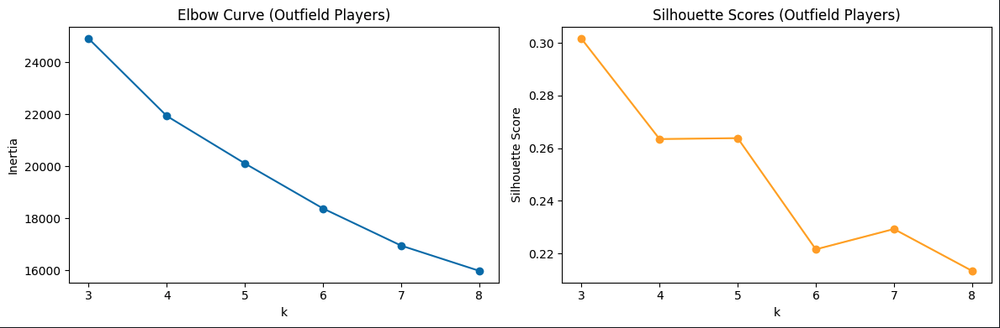

Every football fan has felt it. There is a player who looks unstoppable every weekend for their club. Clinical. Dominant. Exactly where they need to be. Then the international break arrives, they pull on the national shirt, and something just feels off. Not injured. Not unlucky. Just different.

Is it the system? The teammates? Or are some players genuinely built for one context more than the other?

We spent four months trying to answer that question with data. We are four UBC Master of Data Science students who happen to be football fans with strong opinions about pressing systems, squad balance, and why your favourite striker goes quiet at tournaments. For our capstone project with the **Trilemma Foundation**, we turned 12 million raw football events into a platform that can actually measure the club-vs-country gap, player by player, feature by feature.

With the World Cup here, the timing felt right to share what we found.

## The Questions Every Fan and Scout Is Already Asking

Every summer transfer window, every World Cup squad announcement, the same arguments play out. Is this player good enough for the national team? Why does a striker who scores every weekend go quiet at tournaments? Why does a winger who looks ordinary at club level suddenly become unplayable internationally?

These are not just pub arguments. Scouts ask: *how do I find players who fit a specific tactical role without watching every match in La Liga?* National team coaches ask: *which of my in-form players will actually translate to a tournament system?* Analysts ask: *is this player genuinely consistent across contexts, or are we assuming so because they are a big name?*

The data exists to answer all of these. **StatsBomb open data** [@statsbomb2024] tracks every on-ball action including passes, carries, pressures, shots, and dribbles at sub-second resolution across 16 competitions: the top five European leagues, the FIFA World Cup, UEFA Euro, Copa América, and AFCON. That is 3,464 matches, 12.2 million events, and 10,808 players.

The problem is that "the data exists" is not the same as "the data is usable." And that gap is exactly where we spent most of our time. But before we get into how we solved it, here is what we actually found.

## What We Found

### Five Roles That Cover Almost Every Outfield Player

We ran **5,469 outfield player-seasons** through a clustering model built on 13 per-90 metrics covering attack, ball progression, and defending. Five tactical profiles emerge naturally from the data with no hand-labelling and no pre-set categories:

| Archetype | Player-seasons | What the data says |
|---|---|---|
| Low Activity | 1,963 | Low volume across all metrics. Squad players and rotational roles |
| Defensive Anchor | 1,470 | High clearances, interceptions, duels. Low attacking output |
| Creative Playmaker | 807 | High pass completion, progressive passes, carries. Attacking midfielders |
| Pressing Forward | 766 | High pressures, shots, and xG. High-energy forwards and pressing wingers |
| Creative Winger | 463 | High dribbles, carries, shots. Direct wide attackers |

: Player archetype distribution across all player-seasons. {#tbl-cluster-dist}

What is striking is how well these map onto roles any football fan would recognise. And where they surprise you is even more interesting.

### Messi the Pressing Forward (No, Really)

Lionel Messi during the 2015/2016 La Liga season: **Creative Winger**. Dribbling, carrying, cutting inside, operating in the half-spaces. The profile most people associate with him.

Messi at Copa América 2024: **Pressing Forward**.

Argentina's tournament setup asked something completely different from him. He pressed higher, contributed more defensively, and carried less. The event data picks it up automatically. This is not a decline story or an injury story. It is a tactical adaptation story, and it shows up clearly in the numbers:

### Position Shapes Your Role More Than League Does

The bigger pattern across all 5,469 player-seasons: **where you play on the pitch predicts your archetype more than which league you play in**.

Center backs overwhelmingly land in Defensive Anchor or Low Activity. Forwards and attacking midfielders cluster into Pressing Forward and Creative Winger. That much is expected. The more interesting finding is how central midfielders spread across three archetypes: Creative Playmaker, Pressing Forward, and Low Activity. This reflects the genuine tactical range of box-to-box roles. A Bundesliga box-to-box midfielder and a Serie A deep-lying playmaker look completely different in the data, even though both appear as "central midfield" on a lineup sheet.

League effects are real but secondary:

| Competition | Largest archetype | Second largest | Notable pattern |
|-------------|-------------------|----------------|-----------------|
| La Liga | Defensive Anchor (304) | Low Activity (167) | Highest volume, anchors dominate |
| Serie A | Low Activity (240) | Defensive Anchor (138) | Most conservative profile among the top five |
| Ligue 1 | Defensive Anchor (175) | Low Activity (148) | Similar anchor vs passive mix |
| Premier League | Defensive Anchor (169) | Low Activity (163) | Near-even top two |
| Bundesliga | Defensive Anchor (145) | Low Activity (121) | Most Pressing Forwards (83) |

: Outfield cluster counts by competition. Goalkeepers excluded. {#tbl-rq1-competition}

Bundesliga clubs press harder on average. Serie A squads sit deeper on average. If you are scouting across leagues, an archetype comparison only makes sense once you control for position first.

### The Club-vs-Country Gap Is Tactical, Not About Quality

Of **489 players with meaningful minutes in both club and national football**, about one in three showed a genuinely different profile in each context. Here is how the cohort breaks down:

| Quadrant | Players | Share |
|----------|---------|-------|
| Elite | 157 | 32.1% |
| Underperformer | 156 | 31.9% |
| Club Specialist | 88 | 18.0% |
| International Specialist | 88 | 18.0% |

: Observed quadrant counts for dual-context players. {#tbl-quadrant-dist}

Elite players beat the peer median in both club and national settings. Club Specialists are strong against league peers but dip below their national-team cohort. International Specialists are the reverse: players who elevate at tournament level. Underperformers are below median in both.

The biggest difference between Club Specialists and International Specialists was not in goals or xG. It was in **progressive passing into the attacking third** and **carries into the final third per 90**. The club-vs-country gap is mostly a system and role story. Not a talent story.

### Gnabry's Hidden International Pedigree

**Serge Gnabry** is the clearest example from our cohort. Looking only at his Bundesliga club-season data, he looks solid but unremarkable relative to peers. Compare his national-team profile to other international-level players and he stands out as a textbook **International Specialist**.

If you were selecting a Germany squad based purely on club form, you might undervalue him. If you knew he was an International Specialist, that changes the conversation.

### Ask It in Plain English

The dashboard handles regular reporting and sharing. But scouts and analysts always have one-off questions that fixed charts cannot cover, like "Who are the pressing forwards in Ligue 1 with above-average xG?" or "Which Spanish players are Elite in both contexts?"

For those, we built a plain-English chatbot that queries the warehouse directly. Type your question, get BigQuery SQL generated and executed in the background, and receive a formatted answer in under ten seconds. Advanced Mode shows the SQL for anyone who wants to verify or extend the query. A read-only guard blocks anything destructive.

You can try everything yourself at [http://34.11.235.252/](http://34.11.235.252/). The full product walkthrough is in our [demo video](https://canva.link/l2x76q5tw2rriwz).

## Why You Need More Than a Spreadsheet

StatsBomb data at this scale arrives as deeply nested JSON files, one per match, spread across hundreds of files and split across competitions and seasons. Just loading one season of passes for La Liga requires parsing thousands of records, restructuring arrays, and joining multiple tables. For a one-off question, that is annoying. For a scout who needs answers every week, it is a blocker.

This is why we built a **data warehouse**. Not because it sounds impressive, but because it is the only practical way to turn 12 million raw events into answers you can get in seconds.

Think of it this way. If every touch of the ball in every match is one row in a spreadsheet, you have 12 million rows. Finding the top pressing forwards across five leagues means scanning all of them, calculating rates per 90 minutes, filtering out players with too few appearances, and ranking by position. In a spreadsheet, that takes hours and breaks. In a warehouse with pre-built summaries, it takes a second.

We built the full pipeline on Google Cloud. Raw data lands in Google Cloud Storage, moves into **BigQuery** (Google's cloud data warehouse), and gets transformed by **dbt** into clean, analysis-ready tables. Those tables feed two machine learning models, a Looker Studio dashboard, and a plain-English chatbot, all refreshed weekly by **Dagster** with no manual steps.

The warehouse is the invisible foundation. Without it, every question requires a programmer and a few hours. With it, any analyst can ask "who are the elite pressing forwards in Ligue 1?" and get an answer in under ten seconds.

## Why This Matters

None of these outputs answer whether a player is worth signing or whether a squad will win a tournament. Archetypes describe *how* a player is deployed, not their value. Consistency scores measure *how similar* a profile is across contexts. A stable Underperformer is still an underperformer.

But in the right hands, these outputs change the conversation.

**For national team staff:** consistency scores show which players from your league-season shortlist are likely to translate to a tournament system, and which are club specialists who may struggle with the tactical shift. Gnabry's International Specialist label is a conversation starter, not a verdict. But it is a data-grounded one.

**For scouts:** archetype filters let you find pressing forwards in Ligue 1 with above-average xG without writing SQL for every search. The chatbot handles the querying. You handle the judgment.

**For fans:** the next time a player looks completely different at a World Cup, there is a real chance the data backs you up. Systems shape profiles. Messi pressing hard at Copa América 2024 is not a decline. It is Argentina's tournament setup asking something specific from him, and him delivering it.

## Conclusion

We started with a question any football fan asks: does this player actually play the same way for club and country? Four months later, we have a working platform that can answer it, player by player, feature by feature, without writing SQL.

Five tactical archetypes emerge naturally from 5,759 player-seasons across 16 competitions. Position predicts archetype more than league does. About one in three dual-context players shows a genuinely different profile between club and national football, and the gap is driven by system and role, not talent. A plain-English chatbot makes all of it queryable without a line of code.

The platform refreshes weekly. The full product deploys with a single `docker compose up`. And yes, Copa América 2024 Messi is a Pressing Forward. The data confirmed what many of us suspected.

### Key Takeaways

- **One in three dual-context players** specialises in one context. The biggest gaps are in progressive passing and carries, not goals or xG.
- **Gnabry** is a textbook International Specialist. Undervalued if you only watch his club seasons.
- **Messi** is classified as Creative Winger for most club seasons but Pressing Forward at Copa América 2024. Argentina's compact system asked something different from him.
- **Position** drives role assignment more than **league**. Context matters before you compare leagues.
- A **plain-English chatbot** lets any analyst query 12 million events without SQL.

---

## Under the Hood: How the Models Work

*The technical details for the curious. You can skip this section entirely and still get everything from the findings above.*

### The Pipeline Architecture

All of this runs on a fully automated ELT pipeline. StatsBomb data flows from the open data API into Google Cloud Storage, through BigQuery and dbt transformations, and out to the ML models, dashboard, and chatbot. Dagster orchestrates every step on a weekly refresh schedule.

### The 13 Features Behind Every Archetype

Both models (clustering and consistency scoring) run on the same 13 per-90 StatsBomb metrics, so archetype labels and consistency scores stay aligned across the whole product:

- **Attacking:** xG per 90, shots per 90, xG per shot
- **Progression:** passes, progressive passes, pass completion %, carries, dribbles
- **Defending:** pressures, interceptions, blocks, clearances, duels

We only score players with at least **270 minutes** in a season (roughly three full matches). Below that, a single exceptional game can dominate per-90 stats and produce misleading profiles.

### Choosing Five Archetypes (Not Two, Not Eight)

We did not pick k = 5 by default. The full selection workflow is in [Notebook 05](https://github.com/TrilemmaFoundation/UBC-MDS-Soccer-Capstone-2026/blob/main/notebooks/05_player_clustering.py.ipynb) and production code lives in [`src/ml/cluster.py`](https://github.com/TrilemmaFoundation/UBC-MDS-Soccer-Capstone-2026/blob/main/src/ml/cluster.py).

**PCA first.** We reduce the 13 features to the smallest set of principal components explaining at least 80% of variance, which is typically six. PC1 captures overall involvement volume. PC2 contrasts defensive vs attacking output.

**Elbow and silhouette to choose k.** We tested k = 2 through 10. Inertia (within-cluster sum of squares) drops sharply through k = 4, with diminishing returns after k = 5, which is the classic elbow shape. Silhouette score peaked at k = 2 (≈ 0.34), which is typical when per-90 profiles form a continuum rather than hard natural clusters. A k = 2 solution would just separate high- and low-involvement players, which is not useful. Among k = 3 through 7, **k = 5** gave the best balance of cluster separation (silhouette ≈ 0.28) and tactically meaningful archetypes.

**Reproducibility.** Production runs fix `random_state = 42` and `n_init = 10` so assignments are deterministic. Archetype labels in [`seeds/cluster_labels.csv`](https://github.com/TrilemmaFoundation/UBC-MDS-Soccer-Capstone-2026/blob/main/seeds/cluster_labels.csv) are reviewed manually when the player pool grows. Unit tests in [`tests/test_cluster.py`](https://github.com/TrilemmaFoundation/UBC-MDS-Soccer-Capstone-2026/blob/main/tests/test_cluster.py) cover preprocessing and output shape. Chi-square tests on position × archetype cross-tabs ([Notebook 07](https://github.com/TrilemmaFoundation/UBC-MDS-Soccer-Capstone-2026/blob/main/notebooks/07_rq1_role_distribution.py.ipynb)) confirm the clusters align with football intuition rather than arbitrary splits.

### Measuring Club-vs-Country Consistency

For the 489 dual-context players, each feature is standardised **within context**. Club z-scores compare only to other club players. National z-scores compare only to national-team peers. That way, league-level differences in tempo or style do not inflate the gap.

**Performance score** (club and national axes):

$$\text{performance score} = \sum_{i=1}^{13} (Z_i \times w_i)$$

where $w_i$ are PCA-derived feature weights from the clustering pipeline.

**Consistency score** (profile similarity, not quality level):

$$\text{consistency score} = 1 - \frac{1}{13}\sum_{i=1}^{13} \left|Z_{i,\text{club}} - Z_{i,\text{national}}\right|$$

A score of 1 means identical profiles across contexts. A score of 0 means completely different. Quadrants split the cohort at the median of each performance axis.

The weighted score and consistency formula are unit-tested in [`tests/test_consistency.py`](https://github.com/TrilemmaFoundation/UBC-MDS-Soccer-Capstone-2026/blob/main/tests/test_consistency.py) and documented in [Notebook 03](https://github.com/TrilemmaFoundation/UBC-MDS-Soccer-Capstone-2026/blob/main/notebooks/03_consistency_score.ipynb). End-to-end pipeline checks confirmed matching row counts across dbt marts and ML outputs (5,759 clustered player-seasons and 489 dual-context players scored). Full definitions are in the [consistency methodology appendix](https://github.com/TrilemmaFoundation/UBC-MDS-Soccer-Capstone-2026/blob/main/docs/appendix/consistency-explorer.md) and [`docs/consistency.md`](https://github.com/TrilemmaFoundation/UBC-MDS-Soccer-Capstone-2026/blob/main/docs/consistency.md).

## Quick Reference: Key Terms

**Archetype:** A tactical role label (e.g., Pressing Forward, Creative Playmaker) based on a player's per-90 event profile in a given season.

**Per-90 metrics:** Stats scaled to a full 90-minute game so players with different minutes can be compared fairly.

**Consistency score:** How similar a player's tactical profile is for club vs country. A score of 1 means identical profiles. A score of 0 means completely different.

**xG (Expected Goals):** A shot quality estimate based on distance, angle, and defensive pressure.

**Quadrant:** One of four groups (Elite, Club Specialist, International Specialist, Underperformer) based on whether a player beats their peer median in each context.

**Data warehouse:** A database optimised for analytical queries. It is what lets you ask "who are the top pressing forwards in La Liga?" and get an answer in a second instead of an hour.

## Further Reading

- **Live app:** [Football Analytics Platform](http://34.11.235.252/)
- **Demo video:** [Product walkthrough](https://canva.link/l2x76q5tw2rriwz)
- **Project repository:** [UBC-MDS-Soccer-Capstone-2026](https://github.com/TrilemmaFoundation/UBC-MDS-Soccer-Capstone-2026)
- **Clustering design (Notebook 05):** [k selection and archetype notes](https://github.com/TrilemmaFoundation/UBC-MDS-Soccer-Capstone-2026/blob/main/notebooks/05_player_clustering.py.ipynb)
- **Clustering production script:** [`src/ml/cluster.py`](https://github.com/TrilemmaFoundation/UBC-MDS-Soccer-Capstone-2026/blob/main/src/ml/cluster.py)
- **Cluster unit tests:** [`tests/test_cluster.py`](https://github.com/TrilemmaFoundation/UBC-MDS-Soccer-Capstone-2026/blob/main/tests/test_cluster.py)
- **RQ1 validation (position × archetype):** [Notebook 07](https://github.com/TrilemmaFoundation/UBC-MDS-Soccer-Capstone-2026/blob/main/notebooks/07_rq1_role_distribution.py.ipynb)
- **Consistency methodology:** [Consistency Explorer appendix](https://github.com/TrilemmaFoundation/UBC-MDS-Soccer-Capstone-2026/blob/main/docs/appendix/consistency-explorer.md)
- **Consistency scoring runbook:** [`docs/consistency.md`](https://github.com/TrilemmaFoundation/UBC-MDS-Soccer-Capstone-2026/blob/main/docs/consistency.md)
- **Consistency unit tests:** [`tests/test_consistency.py`](https://github.com/TrilemmaFoundation/UBC-MDS-Soccer-Capstone-2026/blob/main/tests/test_consistency.py)
- **Notebook catalog:** [`docs/notebooks.md`](https://github.com/TrilemmaFoundation/UBC-MDS-Soccer-Capstone-2026/blob/main/docs/notebooks.md)
- **Pipeline architecture:** [Partner handover guide](https://github.com/TrilemmaFoundation/UBC-MDS-Soccer-Capstone-2026/blob/main/HANDOVER.md)
- **StatsBomb open data:** [github.com/statsbomb/open-data](https://github.com/statsbomb/open-data)

## References

::: {#refs}
:::
