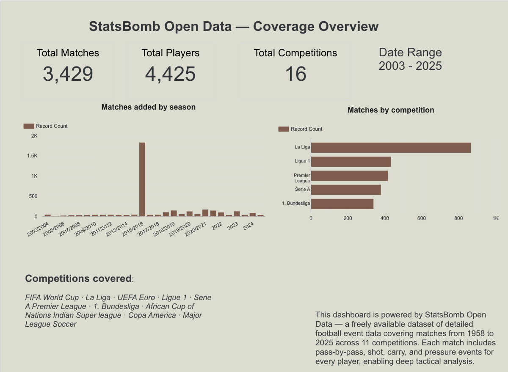

This post focuses on what we found. For the full pipeline, data warehouse design, clustering methodology, and consistency scoring, see our [technical companion post](https://rabin0208.github.io/soccer_capstone_technical_blog/posts/soccer-analytics-platform/).

Every football fan has felt it: a player who looks unstoppable every weekend for their club, clinical and dominant, always exactly where they need to be. Then the international break arrives, they pull on the national shirt, and something just feels off, not because of injury or bad luck, but because they seem like a different player altogether. Is it the system, the teammates, or are some players genuinely built for one context more than the other?

We spent 2 months trying to answer that question with data. We are four UBC Master of Data Science students who happen to be football fans with strong opinions about pressing systems, squad balance, and why your favourite striker goes quiet at tournaments. For our capstone project with the **Trilemma Foundation**, we turned 12 million raw football events into a platform that can actually measure the club-vs-country gap, player by player, feature by feature.

With the World Cup here, the timing felt right to share what we found.

## The Questions Every Fan and Scout Is Already Asking

Every summer transfer window and every World Cup squad announcement brings the same arguments: is this player good enough for the national team, why does a striker who scores every weekend go quiet at tournaments, and why does a winger who looks ordinary at club level suddenly become unplayable internationally?

These are not just pub arguments:

- **Scouts ask:** how do I find players who fit a specific tactical role without watching every match in La Liga?
- **National team coaches ask:** which of my in-form players will actually translate to a tournament system?
- **Analysts ask:** is this player genuinely consistent across contexts, or are we assuming so because they are a big name?

The data exists to answer all of these, but our results come with an important caveat. **StatsBomb open data** [@statsbomb2024] tracks every on-ball action including passes, carries, pressures, shots, and dribbles at sub-second resolution across 16 competitions: the top five European leagues, the FIFA World Cup, UEFA Euro, Copa América, and AFCON. That is 3,464 matches, 12.2 million events, and 10,808 players. Coverage is heavily skewed: the 2015/2016 La Liga season alone accounts for over 800 matches and dominates the dataset, so any finding from this analysis may not generalise to other leagues, seasons, or competitions.

One important detail about scope: our **club-level archetypes are built on the 2015/2016 season**, which is the only season where StatsBomb open data provides complete match coverage across all five top European leagues (La Liga, Premier League, Bundesliga, Serie A, and Ligue 1). La Liga alone accounts for over 800 matches from that season, which is why it dominates the coverage chart below. The club-vs-country consistency analysis draws on a wider window, pairing each player's 2015/2016 club profile against their international appearances across all tournaments in the dataset. Treat every number in this post as provisional. The skew toward La Liga and a single club season means our archetype labels and consistency scores could be wrong for players or leagues with thinner coverage.

The problem is that "the data exists" is not the same as "the data is usable," and that gap is exactly where we spent most of our time. We cover the engineering side in our [technical companion post](https://rabin0208.github.io/soccer_capstone_technical_blog/posts/soccer-analytics-platform/). Here is what we actually found.

## What We Found

### Five Roles That Cover Almost Every Outfield Player

We ran **5,469 outfield player-seasons** through a clustering model built on 13 per-90 metrics covering attack, ball progression, and defending. Five tactical profiles emerge naturally from the data with no hand-labelling and no pre-set categories:

| Archetype | Player-seasons | What the data says |
|---|---|---|
| Low Activity | 1,963 | Low volume across all metrics. Squad players and rotational roles |
| Defensive Anchor | 1,470 | High clearances, interceptions, duels. Low attacking output |
| Creative Playmaker | 807 | High pass completion, progressive passes, carries. Attacking midfielders |
| Pressing Forward | 766 | High pressures, shots, and xG. High-energy forwards and pressing wingers |
| Creative Winger | 463 | High dribbles, carries, shots. Direct wide attackers |

: Player archetype distribution across all player-seasons. {#tbl-cluster-dist}

What is striking is how well these map onto roles any football fan would recognise, and where they surprise you is even more interesting.

### Messi the Pressing Forward (No, Really)

During the 2015/2016 La Liga season, Lionel Messi profiled as a **Creative Winger**, dribbling, carrying, cutting inside, and operating in the half-spaces, the profile most people associate with him. At Copa América 2024, the data classified him as a **Pressing Forward**. Argentina's tournament setup asked something completely different from him: he pressed higher, contributed more defensively, and carried less. The event data picks it up automatically. This is not a decline story or an injury story, but a tactical adaptation story that shows up clearly in the numbers:

### Position Shapes Your Role More Than League Does

The bigger pattern across all 5,469 player-seasons is that **where you play on the pitch predicts your archetype more than which league you play in**. Center backs overwhelmingly land in Defensive Anchor or Low Activity, while forwards and attacking midfielders cluster into Pressing Forward and Creative Winger, which is largely what we would expect. The more interesting finding is how central midfielders spread across three archetypes (Creative Playmaker, Pressing Forward, and Low Activity), reflecting the genuine tactical range of box-to-box roles. A Bundesliga box-to-box midfielder and a Serie A deep-lying playmaker look completely different in the data, even though both appear as "central midfield" on a lineup sheet.

League effects are real but secondary:

| Competition | Largest archetype | Second largest | Notable pattern |
|-------------|-------------------|----------------|-----------------|
| La Liga | Defensive Anchor (304) | Low Activity (167) | Highest volume, anchors dominate |
| Serie A | Low Activity (240) | Defensive Anchor (138) | Most conservative profile among the top five |
| Ligue 1 | Defensive Anchor (175) | Low Activity (148) | Similar anchor vs passive mix |
| Premier League | Defensive Anchor (169) | Low Activity (163) | Near-even top two |
| Bundesliga | Defensive Anchor (145) | Low Activity (121) | Most Pressing Forwards (83) |

: Outfield cluster counts by competition. Goalkeepers excluded. {#tbl-rq1-competition}

Bundesliga clubs press harder on average and Serie A squads sit deeper on average, so if you are scouting across leagues, an archetype comparison only makes sense once you control for position first.

### The Club-vs-Country Gap Is Tactical, Not About Quality

Of **489 players with meaningful minutes in both club and national football**, about one in three showed a genuinely different profile in each context. Here is how the cohort breaks down:

| Quadrant | Players | Share |
|----------|---------|-------|
| Elite | 157 | 32.1% |
| Underperformer | 156 | 31.9% |
| Club Specialist | 88 | 18.0% |
| International Specialist | 88 | 18.0% |

: How 489 players with meaningful club and national team minutes split across four club vs country groups. Elite players rank above average in both settings. Club Specialists are strong for their club but weaker for their country. International Specialists are the opposite. Underperformers rank below average in both. {#tbl-quadrant-dist}

Elite players beat the peer median in both club and national settings. Club Specialists are strong against league peers but dip below their national-team cohort, while International Specialists are the reverse: players who elevate at tournament level. Underperformers sit below median in both contexts. The biggest difference between Club Specialists and International Specialists was not in goals or xG, but in **progressive passing into the attacking third** and **carries into the final third per 90**. The club-vs-country gap is mostly a system and role story, not a talent story.

### Gnabry's Hidden International Pedigree

**Serge Gnabry** is the clearest example from our cohort. When we filter the Consistency Explorer to Germany, his position on the scatter plot tells the story immediately: looking only at his Bundesliga club-season data, he looks solid but unremarkable relative to peers, but in Germany's national-team context he stands out as a textbook **International Specialist**, elevating well above his national-team cohort. If you were selecting a Germany squad based purely on club form, you might undervalue him, but knowing he is an International Specialist changes the conversation entirely.

### Ask It in Plain English

The dashboard handles regular reporting and sharing, but scouts and analysts always have one-off questions that fixed charts cannot cover, like "Who are the pressing forwards in Ligue 1 with above-average xG?" or "Which Spanish players are Elite in both contexts?" For those, we built a plain-English chatbot that queries the warehouse directly. You type your question, BigQuery SQL is generated and executed in the background, and you receive a formatted answer in under ten seconds. Advanced Mode shows the SQL for anyone who wants to verify or extend the query, and a read-only guard blocks anything destructive.

You can try everything yourself at [http://34.11.235.252/](http://34.11.235.252/). The full product walkthrough is in our [demo video](https://canva.link/l2x76q5tw2rriwz).

## Why This Matters

None of these outputs answer whether a player is worth signing or whether a squad will win a tournament. Archetypes describe *how* a player is deployed, not their value, and consistency scores measure *how similar* a profile is across contexts. A stable Underperformer is still an underperformer. But in the right hands, these outputs change the conversation.

**For national team staff**, consistency scores show which players from your league-season shortlist are likely to translate to a tournament system, and which are club specialists who may struggle with the tactical shift. Gnabry's International Specialist label is a conversation starter rather than a verdict, but it is a data-grounded one.

**For scouts**, archetype filters let you find pressing forwards in Ligue 1 with above-average xG without writing SQL for every search. The chatbot handles the querying, and you handle the judgment.

**For fans**, the next time a player looks completely different at a World Cup, there is a real chance the data backs you up. Systems shape profiles, and Messi pressing hard at Copa América 2024 is not a decline but Argentina's tournament setup asking something specific from him, and him delivering it.

## Conclusion

After 2 months, we built a working platform that can measure the club vs country gap player by player, without writing SQL. But the honest read is that our answers are only as good as the data behind them, and that data is skewed.

### The Questions, Answered

- **Scouts ask:** how do I find players who fit a specific tactical role without watching every match in La Liga? **Our answer:** five tactical archetypes emerge from per-90 event data, and the dashboard plus plain-English chatbot let you filter by role, league, and position. You can search for pressing forwards in Ligue 1 with above-average xG without watching every match. Position predicts role more than league does, so always filter by position before comparing across competitions.
- **National team coaches ask:** which of my in-form players will actually translate to a tournament system? **Our answer:** consistency scores and club vs country groups flag who is likely to carry club form into a national setup. About one in three players with meaningful club and national team minutes play a genuinely different role in each setting. Gnabry is a clear example: solid at club level, but an International Specialist for Germany. Club Specialists in our data may struggle when the tactical system changes.
- **Analysts ask:** is this player genuinely consistent across contexts, or are we assuming so because they are a big name? **Our answer:** the data says reputation is not enough. About one in three players with club and national team minutes show a different profile in each setting, and the biggest gaps are in progressive passing and carries, not goals or xG. Messi at Copa América 2024 is the headline example: Creative Winger for most club seasons, Pressing Forward for Argentina.

### A Note on What We Cannot Claim

None of this is definitive. StatsBomb open data over-represents the 2015/2016 La Liga season, club archetypes are anchored to that single season, and international tournament minutes are uneven across players and competitions. A player labelled Club Specialist or Pressing Forward in our platform might look different with fuller coverage of the Premier League, Bundesliga, or more recent seasons. Use these outputs to start a conversation, not to close one.

The platform refreshes weekly, the full product deploys with a single `docker compose up`, and yes, Copa América 2024 Messi is a Pressing Forward in our data. Whether that holds with better-balanced data is a question for the next version of the pipeline.

### Key Takeaways

- **One in three players** with club and national team minutes specialises in one setting. The biggest gaps are in progressive passing and carries, not goals or xG.
- **Gnabry** is a textbook International Specialist. Undervalued if you only watch his club seasons.
- **Messi** is classified as Creative Winger for most club seasons but Pressing Forward at Copa América 2024. Argentina's compact system asked something different from him.
- **Position** drives role assignment more than **league**. Context matters before you compare leagues.
- A **plain-English chatbot** lets any analyst query 12 million events without SQL.
- **Data is skewed** toward the 2015/2016 La Liga season. Treat archetype labels and consistency scores as provisional, not ground truth.

## Further Reading

- **Technical companion post:** [Same Player, Different Game: Technical Overview](https://rabin0208.github.io/soccer_capstone_technical_blog/posts/soccer-analytics-platform/) (pipeline architecture, clustering methodology, consistency scoring, and key terms)
- **Live app:** [Football Analytics Platform](http://34.11.235.252/)
- **Demo video:** [Product walkthrough](https://canva.link/l2x76q5tw2rriwz)
- **Project repository:** [UBC-MDS-Soccer-Capstone-2026](https://github.com/TrilemmaFoundation/UBC-MDS-Soccer-Capstone-2026)
- **Clustering design (Notebook 05):** [k selection and archetype notes](https://github.com/TrilemmaFoundation/UBC-MDS-Soccer-Capstone-2026/blob/main/notebooks/05_player_clustering.py.ipynb)
- **Clustering production script:** [`src/ml/cluster.py`](https://github.com/TrilemmaFoundation/UBC-MDS-Soccer-Capstone-2026/blob/main/src/ml/cluster.py)
- **Cluster unit tests:** [`tests/test_cluster.py`](https://github.com/TrilemmaFoundation/UBC-MDS-Soccer-Capstone-2026/blob/main/tests/test_cluster.py)
- **RQ1 validation (position × archetype):** [Notebook 07](https://github.com/TrilemmaFoundation/UBC-MDS-Soccer-Capstone-2026/blob/main/notebooks/07_rq1_role_distribution.py.ipynb)
- **Consistency methodology:** [Consistency Explorer appendix](https://github.com/TrilemmaFoundation/UBC-MDS-Soccer-Capstone-2026/blob/main/docs/appendix/consistency-explorer.md)
- **Consistency scoring runbook:** [`docs/consistency.md`](https://github.com/TrilemmaFoundation/UBC-MDS-Soccer-Capstone-2026/blob/main/docs/consistency.md)
- **Consistency unit tests:** [`tests/test_consistency.py`](https://github.com/TrilemmaFoundation/UBC-MDS-Soccer-Capstone-2026/blob/main/tests/test_consistency.py)
- **Notebook catalog:** [`docs/notebooks.md`](https://github.com/TrilemmaFoundation/UBC-MDS-Soccer-Capstone-2026/blob/main/docs/notebooks.md)
- **Pipeline architecture:** [Partner handover guide](https://github.com/TrilemmaFoundation/UBC-MDS-Soccer-Capstone-2026/blob/main/HANDOVER.md)
- **StatsBomb open data:** [github.com/statsbomb/open-data](https://github.com/statsbomb/open-data)

## References

::: {#refs}
:::
